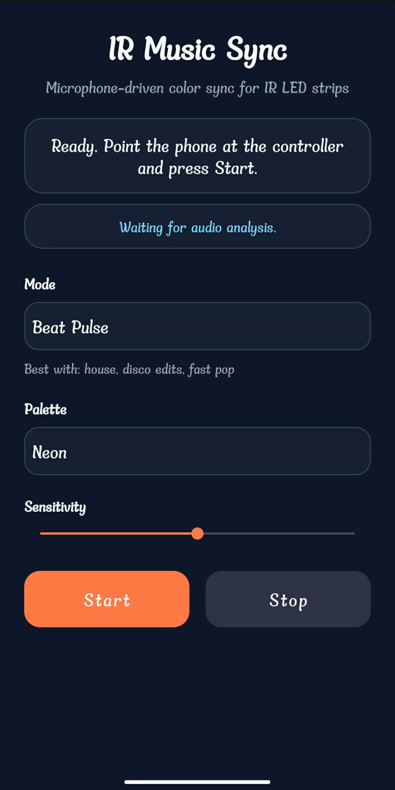

# IRMusicSync

<p align="center">
  
</p>

I was bored in the summer and decided to make a party in my room, so I ended up making this app.

IRMusicSync is an Android app that listens to music through the phone microphone and sends infrared color commands to an LED strip controller. The phone becomes a small audio-reactive remote: point it at the controller, play music, and the lights follow the track.

## Preview

<p align="center">
  
</p>

## What the app does

- listens to live audio from the microphone
- measures bass, mid, and high energy from the signal
- detects beat hits and track intensity
- sends matching IR color commands through `ConsumerIrManager`

## Modes

### Beat Pulse

Built for clean beat changes. The light switches color on detected hits and stays readable instead of flickering too often.

Best with:
- house
- disco edits
- fast pop

### Bass Drive

Built for heavier low-end. The light reacts more to kick and bass weight, so the room feels more punchy.

Best with:
- trap
- hip-hop
- dubstep

### Color Flow

Built for smoother tracks. The light changes more gradually based on the dominant part of the spectrum.

Best with:
- synthwave
- melodic techno
- ambient electronic

## Palettes

- Neon
- Sunset
- Ice

## Requirements

- an Android phone with a real IR blaster
- an IR LED strip controller
- Android Studio if you want to build the project yourself

## Run it

```bash
./gradlew assembleDebug
./gradlew installDebug
```

Or open the project in Android Studio and run it on a physical device with an IR blaster.

## Use it

1. Open the app.
2. Grant microphone permission.
3. Aim the phone at the LED controller.
4. Pick a mode and palette.
5. Press `Start`.
6. Play music near the phone.

## Notes

- The app uses microphone input, not direct internal audio capture.
- Different LED controllers can respond a little differently depending on their IR command set.
- It works best when the phone has a clear line of sight to the controller.
